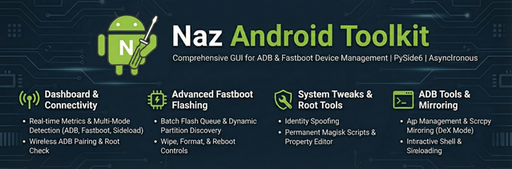

# Naz Android Toolkit
 


Naz Android Toolkit is a comprehensive, asynchronous GUI application for ADB and Fastboot built with PySide6. It is designed for advanced device management, flashing, and system tweaking.

## 🚀 Key Features

### 1. Multi-Mode Device Management (Dashboard)
*   **Real-time Metrics:** Displays device model, build ID, battery level, CPU temperature, and internal storage usage.
*   **Connection Status:** Automatically detects whether a device is in **ADB**, **Fastboot**, or **Sideload** mode.
*   **Root & Bootloader Detection:** Specifically checks for Magisk or system root and identifies bootloader lock status.
*   **Wireless ADB:** Full support for Android 11+ wireless pairing (`adb pair`) and quick connection.

### 2. Advanced Flashing & Recovery (Fastboot)
*   **Batch Flash Queue:** Supports queuing multiple `.img` or `.bin` files for sequential flashing to partitions.
*   **Dynamic Partition Discovery:** Automatically fetches and categorizes partition names (Standard vs. Critical) directly from the device.
*   **Wipe/Format Tools:** Quick access to format partitions (f2fs, ext4, fat) or erase them.
*   **Reboot Control:** Dedicated controls for rebooting to System, Recovery, Bootloader, or Fastbootd.

### 3. System Tweaks & Identity Spoofing (Beta / Experimental)
*   **Device Identity Spoofing:** Includes presets to spoof device identity using `resetprop`. **Note:** This feature is currently in **Beta** and may not work as expected on all devices.
*   **Permanent Fix:** Can install a persistent Magisk boot script to `/data/adb/service.d/` with safety delays and safe-mode checks.
*   **Property Editor:** A live searchable editor for all `getprop` properties, allowing for batch modification and export.

### 4. ADB Tools & Mirroring
*   **App Management:** Install APKs (via browser or **Drag-and-Drop**) and uninstall by package name.
*   **Screen Mirroring:** Integrated `scrcpy` support with specialized **"DeX Mode"** (turns phone screen off, stays awake, and uses high-bitrate video).
*   **Interactive Shell:** One-click access to a full interactive ADB shell in an external terminal window.
*   **Sideloading:** Streamlined workflow for flashing OTAs or APKs in recovery mode.

### 5. Technical & Safety Features
*   **Asynchronous Execution:** All CLI commands run in background threads, keeping the UI responsive.
*   **Safety Verifications:** Triggers warnings for high-risk operations like flashing or erasing partitions.
*   **Session Logging:** Comprehensive color-coded console logs that can be saved to disk.
*   **Boot Monitor:** Directs `logcat` output to a file to capture boot-time issues.

## 🛠 Prerequisites

Ensure you have the following installed and in your system PATH:
*   [Android Platform Tools](https://developer.android.com/studio/releases/platform-tools) (adb, fastboot)
*   [scrcpy](https://github.com/Genymobile/scrcpy) (optional, for mirroring features)

## 📦 Installation & Usage

1. Clone the repository:
   ```bash
   git clone https://github.com/yourusername/naz-android-toolkit.git
   cd naz-android-toolkit
   ```

2. Create a virtual environment and install dependencies:
   ```bash
   python -m venv .venv
   source .venv/bin/activate  # On Windows use: .venv\Scripts\activate
   pip install -r requirements.txt
   ```

3. Run the application:
   ```bash
   python main.py
   ```

## 🏗 Building Executables

The toolkit can be bundled into a standalone executable using PyInstaller.

```bash
# General command (Linux/macOS)
pyinstaller --noconsole --onefile --icon="assets/logo.svg" --add-data "assets:assets" --add-data "presets:presets" main.py

# Windows (Requires .ico file)
# pyinstaller --noconsole --onefile --icon="assets/logo.ico" --add-data "assets;assets" --add-data "presets;presets" main.py
```

## ⚖️ License
This project is for educational and technical use. Always exercise caution when flashing partitions or modifying system properties.
